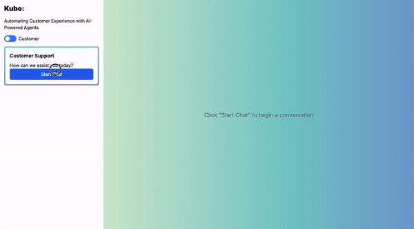

# Kubo AI 

An AI avatar system designed for real-time, human-like interactions with unprecedented low latency. Built with optimized inference pipelines and OpenVINO model quantization techniques.




## 🎯 Core Mission

Creating the most human-like AI interaction possible through:
- Ultra-low latency responses
- Real-time multimodal processing
- Optimized inference pipelines
- Natural conversational flow
- Visual Stimuli 

## 🌟 Features

- **Interactive AI Avatar**
  - Real-time facial expressions and animations
  - Text-to-Speech with lip-sync
  - Natural voice interaction
  - Contextual conversation memory

- **Multi-Modal Communication**
  - Text chat interface
  - Voice input/output
  - Animated avatar responses
  - Real-time WebSocket communication

- **Advanced AI Processing**
  - Context-aware responses using vector similarity
  - Multiple LLM support (OpenAI GPT, Qwen)
  - Conversation history tracking
  - Dynamic facial expressions and animations

## 🛠️ Model Optimizations

| Model Type | Implementation | Optimization | Details |
|------------|----------------|--------------|----------|
| **LLM** | Qwen 2.5, Llama 3.1 8B | AMX Build | [llama.cpp](https://github.com/ggerganov/llama.cpp) with [AMX support](https://github.com/ggerganov/llama.cpp/issues/2555)  |
| **ASR** | WhisperCPP | OpenVINO + INT8 | Tiny model optimized for real-time transcription  |
| **TTS** | MeloTTS | OpenVINO | Optimized speech synthesis model  |
| **Object Detection** | YOLO | OpenVINO INT8 | Custom trained model  Performance:  |
| **VAD** | Silero | Browser ONNX | Real-time voice activity detection [Implementation](https://github.com/ricky0123/vad) |
| **Embeddings** | MiniLM-L6-v2 | OpenVINO INT8 | Binary embeddings for conversation context [Model](https://huggingface.co/sentence-transformers/all-MiniLM-L6-v2/tree/main/openvino) |
| **Lip Sync** | Custom Model | OVMS | Optimized for real-time performance  |

### Custom Lipsync Performance
```
Processing Time Improvements:
Short Audio:  1.984s → 0.007s (283x faster)
Medium Audio: 3.280s → 0.009s (364x faster)
Long Audio:   5.550s → 0.013s (427x faster)

Accuracy Maintenance:
Short Audio: 10.1 vs 9.8 mouth cues
Medium Audio: 21.2 vs 20.1 mouth cues
Long Audio: 38.7 vs 38.3 mouth cues
```

### OpenVINO Model Server Deployment
Models deployed on OVMS for efficient serving:


## 🛠️ Technical Stack

### Frontend Layer
- React + Vite for UI
- Three.js for 3D rendering
- Browser-based VAD using ONNX runtime
- WebSocket for real-time communication
- Custom audio processing pipeline

### Backend Infrastructure
- Node.js/Express server
- WebSocket server for real-time communication
- MongoDB for conversation persistence
- OpenVINO Model Server (OVMS) deployment
- Custom binary vector storage

## 🧠 AI/LLM Implementation

### LangChain Integration & Function Calling
- Built with LangChain for structured, maintainable LLM interactions
- Custom prompt templates for consistent avatar behavior
- Function calling for specific avatar expressions and animations
- Chain-based architecture for modular processing

### Structured Output Handling
- JSON output parsing with Zod schema validation
- Predefined response structure for:
  - Text content
  - Facial expressions
  - Animation sequences
  - Avatar behaviors
- Type-safe responses throughout the system

### Context-Aware Processing
- Vector similarity search for conversation history
- Binary embeddings for efficient storage and retrieval
- Dynamic context integration in prompts
- Relevance-based response generation


## 🚀 Installation

1. **Clone and Setup**
```bash
git clone https://github.com/ankithreddypati/Kubo-app.git

# Frontend Setup
cd frontend
npm install
npm start

# Backend Setup
cd backend
npm install
npm run dev
```

2. **Environment Configuration**
```bash
cp .env.local .env
```

Required variables:
```env
OPENAI_API_KEY=your_key
MONGODB_URI=your_mongodb
BINARY_VECTOR_SERVICE_URL=vector_service_url
MELOTTS_URL=melotts_url
LIPSYNC_MODEL_URL=lipsync_url
MODEL_SERVER_AUTH_TOKEN=auth_token
```

## 🔄 Real-time Communication Flow

### WebSocket Events
**Client → Server:**
```javascript
// Text Input
{
  type: 'chat',
  message: 'Hello!'
}

// Voice Input
{
  type: 'audio',
  transcription: 'Hello!'
}

// Config Update
{
  type: 'config',
  model: 'qwen',
  tts: {
    language: 'EN',
    accent: 'EN-BR',
    speed: 1.2
  }
}
```

**Server → Client:**
```javascript
{
  type: 'response',
  messages: [{
    text: 'Hi! How can I help?',
    facialExpression: 'smile',
    animation: 'Talking1',
    audio: 'base64_audio',
    lipsync: {
      frameData: [...],
      timing: [...]
    }
  }]
}
```

## 🚦 Development Status & Roadmap

Current status: **Beta**

### Future Improvements
1. **Performance Optimization**
   - Integration with OptILM for smaller LLMs
   - Further model quantization
   - Enhanced caching strategies

2. **Feature Development**
   - Custom avatar integration system
   - Advanced analytics dashboard
   - Voice emotion detection
   - Multi-language optimization

3. **Infrastructure**
   - Code cleanup and documentation
   - Enhanced error handling
   - Automated deployment pipeline
   - Performance monitoring system

## 📚 Resources

- [llama.cpp AMX Build Guide](https://github.com/ggerganov/llama.cpp/issues/2555)
- [Binary Embeddings Background](https://emschwartz.me/binary-vector-embeddings-are-so-cool/)
- [VAD Implementation](https://github.com/ricky0123/vad)
- [OpenVINO Documentation](https://docs.openvino.ai/)

## 🤝 Contributing

This project was initially developed for a hackathon and is now open for contributions. Key areas:
- code refactoring and testing
- LLM Performance optimization 
- Model compression techniques
- Real-time processing improvements
- Documentation 

---

Checkout App at : https://kubocodeserver-ankithreddy137-dev.apps.cluster.intel.sandbox1234.opentlc.com/codeserver/proxy/5174/

Built with OpenVINO optimization for real-time AI interactions

## 📚 Resources

- [llama.cpp AMX Build Guide](https://github.com/ggerganov/llama.cpp/issues/2555)
- [Binary Embeddings Background](https://emschwartz.me/binary-vector-embeddings-are-so-cool/)
- [VAD Implementation](https://github.com/ricky0123/vad)
- [OpenVINO Documentation](https://docs.openvino.ai/)
- [MeloTTS OV](https://blog.openvino.ai/blog-posts/optimizing-melotts-for-aipc-deployment-with-openvino-a-lightweight-tts-solution)
- [Langchain chathistory](https://js.langchain.com/docs/tutorials/qa_chat_history)


---
